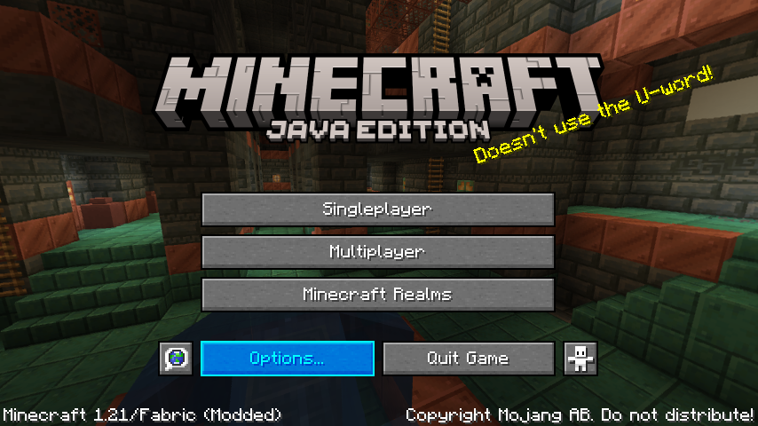
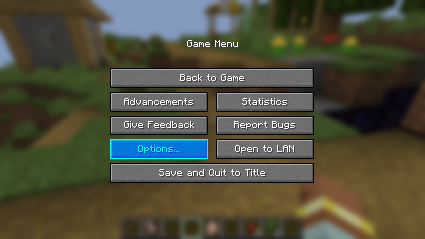
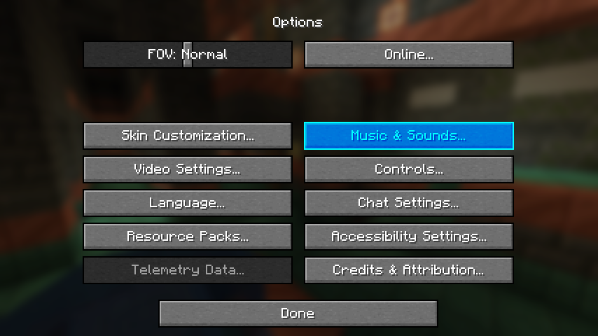
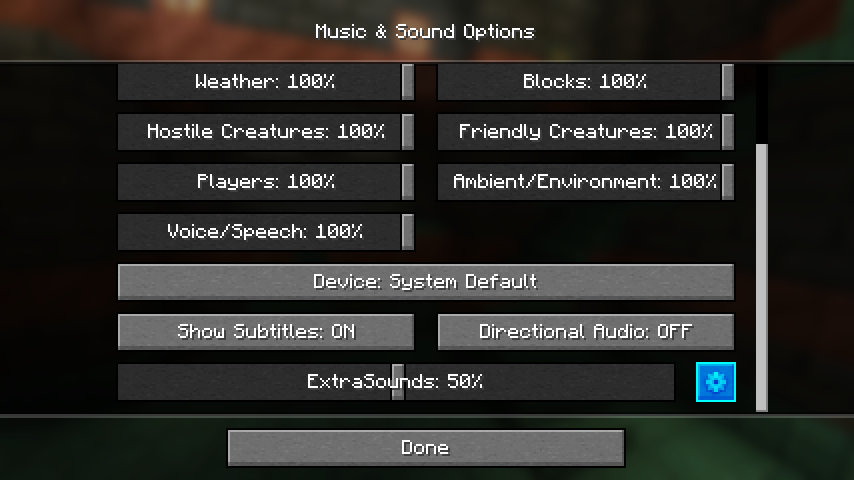
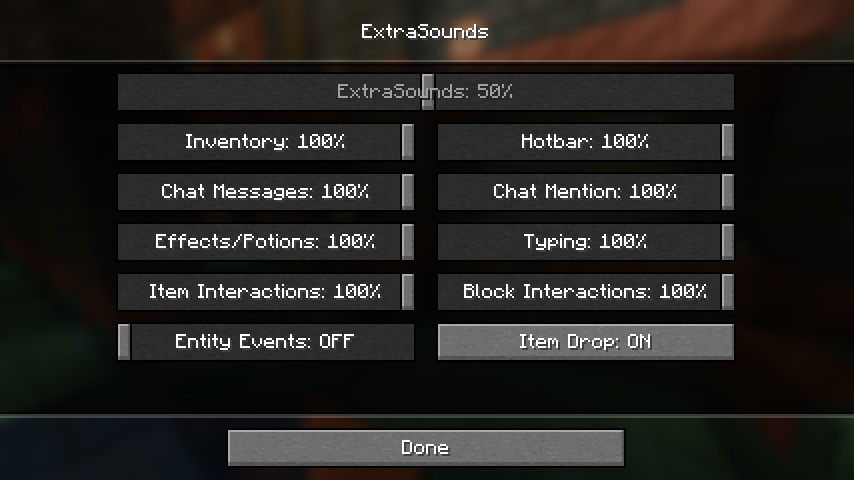

# Unofficial Port of [ExtraSounds](https://github.com/stashymane/extra-sounds) `v3`

![Language Java17]

[![Mod loader Fabric]][Fabric]
[![Mod loader Quilt]][Quilt]

[![Requires Fabric API]][Fabric API]
[![Requires QFAPI]][QSL]

[![Latest build on GitHub]][GitHubTags]

**[~~Modrinth~~](https://modrinth.com/mod/extrasounds)
| [~~CurseForge~~](https://www.curseforge.com/minecraft/mc-mods/extrasounds)**

This port is not published on Modrinth and CurseForge.
Please check [GitHub Tags][GitHubTags]’ commit messages;
press “…” (toggle message) button next to the version to show.

Also, there may still be available the artifacts
generated by [GitHub Actions](https://github.com/lonefelidae16/extra-sounds/actions).
Sign in to GitHub to get it.

## 🧩 Compatibility

This port has been bumped to **v3**
and works with the following Minecraft versions:

* Minecraft 1.18 family
  - 1.18 - 1.18.2
* Minecraft 1.19 family
  - 1.19 - 1.19.4
* Minecraft 1.20 family
  - 1.20 - 1.20.6
* Minecraft 1.21 family
  - 1.21 - 1.21.4

If the version you want isn’t available, [you can request a new backward compatibility](https://github.com/lonefelidae16/extra-sounds/issues/new?assignees=&labels=backward,enhancement&projects=&template=backward.yml).

When you find a bug or compatibility problem, [you can raise an issue](https://github.com/lonefelidae16/extra-sounds/issues/new?assignees=&labels=bug&projects=&template=bug_report.yml).

## ♬ Features

* Hotbar scroll sounds
* Inventory click sounds (based on clicked item)
* Drop sound (based on amount of items dropped)
* Inventory scroll sound (based on scroll speed)
  - Creative inventory
  - Loom
  - Stonecutter
  - Trading with villagers
* Chat message sound
* Chat @mention sound
* Keyboard typing sound
* Status effect/potion sounds
* Item interaction sounds on Hotbar
  - Pulling bow sound
* Block interaction sounds
  - Campfire
  - Flower pot
  - Repeater
  - Redstone wire
  - Daylight detector
  - Redstone Ores
  - Armor stand
* Mod integrations
  - [RoughlyEnoughItems](https://www.curseforge.com/minecraft/mc-mods/roughly-enough-items)
  - [MidnightControls](https://www.curseforge.com/minecraft/mc-mods/midnightcontrols)
* [Mod API for developers](https://github.com/lonefelidae16/extra-sounds/wiki/Custom-sounds-for-mod-developers)
* [Every sound is configurable via resource packs](https://github.com/lonefelidae16/extra-sounds/wiki/Custom-sounds-for-resource-pack-creators)

## ⚙ Volume Settings

ExtraSounds allows volume control by pre-classified categories.

1. Open “Options” screen.

    

2. Select “Music &amp; Sounds...” button.

   

3. Click the cog next to the “ExtraSounds” slider.

   

4. You can see the category widgets defined in [Mixers.java](logics/src/main/java/dev/stashy/extrasounds/logics/Mixers.java).

   

## ❓ Known Issues

By the commit [508210a](https://github.com/lonefelidae16/extra-sounds/commit/508210ae20cf8cf72316d642f803fe637d7eee54) makes
ExtraSounds a full client mod and has the following problems:

* Since it’s necessary to communicate with the server to obtain the results,
  a sound is played regardless of whether your action succeeds or fails.
  - e.g.) When both Chest and PlayerInventory are full and trying to move the stack with
    <kbd>Shift</kbd> + Click. The stack will not be moved, but the sound will be played.

## 🛠 Development
To build this project yourself, [follow the guide on the Wiki](https://github.com/lonefelidae16/extra-sounds/wiki).

[Language Java17]: https://img.shields.io/badge/language-Java%2017-orange?logo=data:image/svg%2bxml;base64,PHN2ZyB4bWxucz0iaHR0cDovL3d3dy53My5vcmcvMjAwMC9zdmciIHdpZHRoPSI2NCIgaGVpZ2h0PSI2NCIgdmlld0JveD0iMCAwIDMyIDMyIj48cGF0aCBkPSJNMTEuNjIyIDI0Ljc0cy0xLjIzLjc0OC44NTUuOTYyYzIuNTEuMzIgMy44NDcuMjY3IDYuNjI1LS4yNjdhMTAuMDIgMTAuMDIgMCAwIDAgMS43NjMuODU1Yy02LjI1IDIuNjcyLTE0LjE2LS4xNi05LjI0NC0xLjU1em0tLjgtMy40NzNzLTEuMzM2IDEuMDE1Ljc0OCAxLjIzYzIuNzI1LjI2NyA0Ljg2Mi4zMiA4LjU1LS40MjdhMy4yNiAzLjI2IDAgMCAwIDEuMjgyLjgwMWMtNy41MzQgMi4yNDQtMTUuOTc2LjIxNC0xMC41OC0xLjYwM3ptMTQuNzQ3IDYuMDlzLjkwOC43NDgtMS4wMTUgMS4zMzZjLTMuNTggMS4wNy0xNS4wMTQgMS4zOS0xOC4yMiAwLTEuMTIyLS40OCAxLjAxNS0xLjE3NSAxLjctMS4yODIuNjk1LS4xNiAxLjA3LS4xNiAxLjA3LS4xNi0xLjIzLS44NTUtOC4xNzUgMS43NjMtMy41MjYgMi41MSAxMi43NyAyLjA4NCAyMy4yOTYtLjkwOCAxOS45ODMtMi40MDR6TTEyLjIgMTcuNjMzcy01LjgyNCAxLjM5LTIuMDg0IDEuODdjMS42MDMuMjE0IDQuNzU1LjE2IDcuNjk0LS4wNTMgMi40MDQtLjIxNCA0LjgxLS42NCA0LjgxLS42NHMtLjg1NS4zNzQtMS40NDMuNzQ4Yy01LjkzIDEuNTUtMTcuMzEyLjg1NS0xNC4wNTItLjc0OCAyLjc3OC0xLjMzNiA1LjA3Ni0xLjE3NSA1LjA3Ni0xLjE3NXptMTAuNDIgNS44MjRjNS45ODQtMy4xIDMuMjA2LTYuMDkgMS4yODItNS43MTctLjQ4LjEwNy0uNjk1LjIxNC0uNjk1LjIxNHMuMTYtLjMyLjUzNC0uNDI3YzMuNzk0LTEuMzM2IDYuNzg2IDQuMDA3LTEuMjMgNi4wOSAwIDAgLjA1My0uMDUzLjEwNy0uMTZ6bS05LjgzIDguNDQyYzUuNzcuMzc0IDE0LjU4Ny0uMjE0IDE0LjgtMi45NCAwIDAtLjQyNyAxLjA3LTQuNzU1IDEuODctNC45MTYuOTA4LTExLjAwNy44LTE0LjU4Ny4yMTQgMCAwIC43NDguNjQgNC41NDIuODU1eiIgZmlsbD0iIzRlNzg5NiIvPjxwYXRoIGQ9Ik0xOC45OTYuMDAxczMuMzEzIDMuMzY2LTMuMTUyIDguNDQyYy01LjE4MyA0LjExNC0xLjE3NSA2LjQ2NSAwIDkuMTM3LTMuMDQ2LTIuNzI1LTUuMjM2LTUuMTMtMy43NC03LjM3M0MxNC4yOTQgNi44OTMgMjAuMzMyIDUuMyAxOC45OTYuMDAxem0tMS43IDE1LjMzNWMxLjU1IDEuNzYzLS40MjcgMy4zNjYtLjQyNyAzLjM2NnMzLjk1NC0yLjAzIDIuMTM3LTQuNTQyYy0xLjY1Ni0yLjQwNC0yLjk0LTMuNTggNC4wMDctNy41ODcgMCAwLTEwLjk1MyAyLjcyNS01LjcxNyA4Ljc2M3oiIGZpbGw9IiNmNTgyMTkiLz48L3N2Zz4=
[Language Java21]: https://img.shields.io/badge/language-Java%2021-orange?logo=data:image/svg%2bxml;base64,PHN2ZyB4bWxucz0iaHR0cDovL3d3dy53My5vcmcvMjAwMC9zdmciIHdpZHRoPSI2NCIgaGVpZ2h0PSI2NCIgdmlld0JveD0iMCAwIDMyIDMyIj48cGF0aCBkPSJNMTEuNjIyIDI0Ljc0cy0xLjIzLjc0OC44NTUuOTYyYzIuNTEuMzIgMy44NDcuMjY3IDYuNjI1LS4yNjdhMTAuMDIgMTAuMDIgMCAwIDAgMS43NjMuODU1Yy02LjI1IDIuNjcyLTE0LjE2LS4xNi05LjI0NC0xLjU1em0tLjgtMy40NzNzLTEuMzM2IDEuMDE1Ljc0OCAxLjIzYzIuNzI1LjI2NyA0Ljg2Mi4zMiA4LjU1LS40MjdhMy4yNiAzLjI2IDAgMCAwIDEuMjgyLjgwMWMtNy41MzQgMi4yNDQtMTUuOTc2LjIxNC0xMC41OC0xLjYwM3ptMTQuNzQ3IDYuMDlzLjkwOC43NDgtMS4wMTUgMS4zMzZjLTMuNTggMS4wNy0xNS4wMTQgMS4zOS0xOC4yMiAwLTEuMTIyLS40OCAxLjAxNS0xLjE3NSAxLjctMS4yODIuNjk1LS4xNiAxLjA3LS4xNiAxLjA3LS4xNi0xLjIzLS44NTUtOC4xNzUgMS43NjMtMy41MjYgMi41MSAxMi43NyAyLjA4NCAyMy4yOTYtLjkwOCAxOS45ODMtMi40MDR6TTEyLjIgMTcuNjMzcy01LjgyNCAxLjM5LTIuMDg0IDEuODdjMS42MDMuMjE0IDQuNzU1LjE2IDcuNjk0LS4wNTMgMi40MDQtLjIxNCA0LjgxLS42NCA0LjgxLS42NHMtLjg1NS4zNzQtMS40NDMuNzQ4Yy01LjkzIDEuNTUtMTcuMzEyLjg1NS0xNC4wNTItLjc0OCAyLjc3OC0xLjMzNiA1LjA3Ni0xLjE3NSA1LjA3Ni0xLjE3NXptMTAuNDIgNS44MjRjNS45ODQtMy4xIDMuMjA2LTYuMDkgMS4yODItNS43MTctLjQ4LjEwNy0uNjk1LjIxNC0uNjk1LjIxNHMuMTYtLjMyLjUzNC0uNDI3YzMuNzk0LTEuMzM2IDYuNzg2IDQuMDA3LTEuMjMgNi4wOSAwIDAgLjA1My0uMDUzLjEwNy0uMTZ6bS05LjgzIDguNDQyYzUuNzcuMzc0IDE0LjU4Ny0uMjE0IDE0LjgtMi45NCAwIDAtLjQyNyAxLjA3LTQuNzU1IDEuODctNC45MTYuOTA4LTExLjAwNy44LTE0LjU4Ny4yMTQgMCAwIC43NDguNjQgNC41NDIuODU1eiIgZmlsbD0iIzRlNzg5NiIvPjxwYXRoIGQ9Ik0xOC45OTYuMDAxczMuMzEzIDMuMzY2LTMuMTUyIDguNDQyYy01LjE4MyA0LjExNC0xLjE3NSA2LjQ2NSAwIDkuMTM3LTMuMDQ2LTIuNzI1LTUuMjM2LTUuMTMtMy43NC03LjM3M0MxNC4yOTQgNi44OTMgMjAuMzMyIDUuMyAxOC45OTYuMDAxem0tMS43IDE1LjMzNWMxLjU1IDEuNzYzLS40MjcgMy4zNjYtLjQyNyAzLjM2NnMzLjk1NC0yLjAzIDIuMTM3LTQuNTQyYy0xLjY1Ni0yLjQwNC0yLjk0LTMuNTggNC4wMDctNy41ODcgMCAwLTEwLjk1MyAyLjcyNS01LjcxNyA4Ljc2M3oiIGZpbGw9IiNmNTgyMTkiLz48L3N2Zz4=

[Quilt]: https://quiltmc.org
[Mod loader Quilt]: https://img.shields.io/badge/modloader-Quilt-8007e8?logo=data:image/png;base64,iVBORw0KGgoAAAANSUhEUgAAAEAAAABACAYAAACqaXHeAAAACXBIWXMAAADGAAAAxgGwdJvFAAAFU0lEQVR4nO1bwW7bOBCdCHtP+wUNxIvhS7yA7kkPOjf9AKPam4/OF2zzB96bblXhH0jPPkS5G1jnIvgib/IFtX/ALoYZemmKtEWRRe3aDzAsURbJGQ6HM4/02Wq1gmNGcNTSnxQA8IdakDK4AOCfJpj3SpiI98r2rAMAbxrWNWFFOMeL1nCJdXQa1gPTbpCbnm34ABIeBThv2hgAfOyVcF+2ZwkAfHGo54kVIRe6NVxiny4d6vpn2g36ugfqFLhwFB6kkUoc67k0XLv0qYKj9wEnBXiqZwEAf/ZKOOuV8BkLWBFesyI8A4C/LOt6AoC39C7HtBvg9Vt65hUnC/BUDzrOf1MGq5S9WkDZnuVle7ZqsBKgw/tO73K0hku8/u64EmhxsoA96MMvxdEroBIKO+CWoshnqqJPYTAGRJ8sql3QO3Op7D19D3z7AV8KeAGArFf+32lWhDwnKNuzuaUCclaE93KBiOU9hMQV+FLAOxz9lPHRR0VkZXs2oBDUNon5ULZnKOgcYwl4FTwna/K+CtRRwIK+dTnCCwkP9I0fkXmh4FcN+6UKqqtHblvtb+18po4TvKaPilsS8qVuYx5havsbJXS1I0ZVAXP1B5jfyzm+hAnN+We1XPluioX03kJtY9oNtG1T+b1aburDxhRAQVMGHw3z9k65F41nktmjUnjjrAj7ZXv27ECIyEKgBd7saBuka7lsPu0GA1MjR0+KVpwgMTlrMkN4YoztlZ/2camTvD0QjcWZF6KxMgcLyKbdAN+HKOb1y6PYH49gEsUwUKw1G48gi2KQZcApkYxH1eldUQBxeKbkRfXEQjDZ21+h2bMiHJDwH2wk1rSX0XWueHZd2yCZ/oVSnilTaA3VAiqjRRahQ0JBjuov3ijfPqAua0kUg67tmyjWCmvsS504wGQRnywjPJ8wtY3xw3827fjMBXziUalL3DcNrIzYRwXcTbvBZ7lgPHoNxKKYky1/+2xsHxXQbw2X/EIoggQHyjC9Yh8VcC6NshDc66jLOHpC5KSAPejDL8U+KuArboTQZgjHeARn+MFnvhvbRyfYaQ2XfNkTVFgUr/mIxlvkJuyjAjCae6BrYQUPW37vhDpT4MnAsCyIgbHBnYbcADJt7/t+deBCiSWsCG8sOv5IgU2FnJh2g+RnBDl1oCpgogqEx1TEURUFokx+tpCYnEzzjg1kh+fq/Ix9OXpG6OjjgI1VIGWcOMhlXh4PPdAz1VTe90rIU8Z/L9JUnALXSK4SjSUzOY+Y1ekyOlzjaamTvf3X8cjunBH1v6OeVtsG1QI66qYEVkoVmyA/O5fYmIHjgSsrskUavAc6q1BLeXXiANMZu0HKwGav7opGv+LticZqHOToLBeZrJRxC97qjOsowCTgZYO9OlNa25haMwgvsFMJPp3gLW1ji8b6dO89fhfYIbzAl23T4adtjyNvD6/mbbs9Xgs1hRcwWoIvCxDb47nQNm5aRDHvoPGcblNYCi+gtQSfU+AdLYfioLXYtHA9eruBhsILVJRwUIGQo/ACG0o4GAV4El5grQSffMA3SqbEnBdb1zeunfYsvAB3jL4UwE92KauA2NnNbLerNKhEqJ6Q+FIAOjpcATAVzjFHoC3qC9OurCW0W9s+6vXpAy4p0hPkSUL3ziNHiY3tqfNdQN4jORgnSEGMLyU8Udbq1QIEdEyRF3hSwlp4vKkwQimrHDuxAR6S4tleFIPzERnhSFXQEtbkD1kbwiMOlhJroISK8IiDpcQsp4NWeMRBc4I1lWAUHnHwpOgOJWwVHvFbsMIGJewUHvFb7QuQYxR/ttgIzbUAgB9KOM3uc+PN7QAAAABJRU5ErkJggg==

[Fabric]: https://fabricmc.net
[Mod loader Fabric]: https://img.shields.io/badge/modloader-Fabric-ffffd0?logo=data:image/png;base64,iVBORw0KGgoAAAANSUhEUgAAACAAAAAgCAYAAABzenr0AAAACXBIWXMAAAsTAAALEwEAmpwYAAAFHGlUWHRYTUw6Y29tLmFkb2JlLnhtcAAAAAAAPD94cGFja2V0IGJlZ2luPSLvu78iIGlkPSJXNU0wTXBDZWhpSHpyZVN6TlRjemtjOWQiPz4gPHg6eG1wbWV0YSB4bWxuczp4PSJhZG9iZTpuczptZXRhLyIgeDp4bXB0az0iQWRvYmUgWE1QIENvcmUgNS42LWMxNDIgNzkuMTYwOTI0LCAyMDE3LzA3LzEzLTAxOjA2OjM5ICAgICAgICAiPiA8cmRmOlJERiB4bWxuczpyZGY9Imh0dHA6Ly93d3cudzMub3JnLzE5OTkvMDIvMjItcmRmLXN5bnRheC1ucyMiPiA8cmRmOkRlc2NyaXB0aW9uIHJkZjphYm91dD0iIiB4bWxuczp4bXA9Imh0dHA6Ly9ucy5hZG9iZS5jb20veGFwLzEuMC8iIHhtbG5zOmRjPSJodHRwOi8vcHVybC5vcmcvZGMvZWxlbWVudHMvMS4xLyIgeG1sbnM6cGhvdG9zaG9wPSJodHRwOi8vbnMuYWRvYmUuY29tL3Bob3Rvc2hvcC8xLjAvIiB4bWxuczp4bXBNTT0iaHR0cDovL25zLmFkb2JlLmNvbS94YXAvMS4wL21tLyIgeG1sbnM6c3RFdnQ9Imh0dHA6Ly9ucy5hZG9iZS5jb20veGFwLzEuMC9zVHlwZS9SZXNvdXJjZUV2ZW50IyIgeG1wOkNyZWF0b3JUb29sPSJBZG9iZSBQaG90b3Nob3AgQ0MgMjAxOCAoV2luZG93cykiIHhtcDpDcmVhdGVEYXRlPSIyMDE4LTEyLTE2VDE2OjU0OjE3LTA4OjAwIiB4bXA6TW9kaWZ5RGF0ZT0iMjAxOS0wNy0yOFQyMToxNzo0OC0wNzowMCIgeG1wOk1ldGFkYXRhRGF0ZT0iMjAxOS0wNy0yOFQyMToxNzo0OC0wNzowMCIgZGM6Zm9ybWF0PSJpbWFnZS9wbmciIHBob3Rvc2hvcDpDb2xvck1vZGU9IjMiIHBob3Rvc2hvcDpJQ0NQcm9maWxlPSJzUkdCIElFQzYxOTY2LTIuMSIgeG1wTU06SW5zdGFuY2VJRD0ieG1wLmlpZDowZWRiMWMyYy1mZjhjLWU0NDEtOTMxZi00OTVkNGYxNGM3NjAiIHhtcE1NOkRvY3VtZW50SUQ9InhtcC5kaWQ6MGVkYjFjMmMtZmY4Yy1lNDQxLTkzMWYtNDk1ZDRmMTRjNzYwIiB4bXBNTTpPcmlnaW5hbERvY3VtZW50SUQ9InhtcC5kaWQ6MGVkYjFjMmMtZmY4Yy1lNDQxLTkzMWYtNDk1ZDRmMTRjNzYwIj4gPHhtcE1NOkhpc3Rvcnk+IDxyZGY6U2VxPiA8cmRmOmxpIHN0RXZ0OmFjdGlvbj0iY3JlYXRlZCIgc3RFdnQ6aW5zdGFuY2VJRD0ieG1wLmlpZDowZWRiMWMyYy1mZjhjLWU0NDEtOTMxZi00OTVkNGYxNGM3NjAiIHN0RXZ0OndoZW49IjIwMTgtMTItMTZUMTY6NTQ6MTctMDg6MDAiIHN0RXZ0OnNvZnR3YXJlQWdlbnQ9IkFkb2JlIFBob3Rvc2hvcCBDQyAyMDE4IChXaW5kb3dzKSIvPiA8L3JkZjpTZXE+IDwveG1wTU06SGlzdG9yeT4gPC9yZGY6RGVzY3JpcHRpb24+IDwvcmRmOlJERj4gPC94OnhtcG1ldGE+IDw/eHBhY2tldCBlbmQ9InIiPz4/HiGMAAAAtUlEQVRYw+XXrQqAMBQF4D2P2eBL+QIG8RnEJFaNBjEum+0+zMQLtwwv+wV3ZzhhMDgfJ0wUSinxZUQWgKos1JP/AbD4OneIDyQPwCFniA+EJ4CaXm4TxAXCC0BNHgLhAdAnx9hC8PwGSRtAFVMQjF7cNTWED8B1cgwW20yfJgAvrssAsZ1cB3g/xckAxr6FmCDU5N6f488BrpCQ4rQBJkiMYh4ACmLzwOQF0CExinkCsvw7vgGikl+OotaKRwAAAABJRU5ErkJggg==

[Requires Fabric API]: ./md-resource/images/requires-fabric-api.png
[Fabric API]: https://www.curseforge.com/minecraft/mc-mods/fabric-api
[Requires QFAPI]: ./md-resource/images/requires-qfapi.png
[QSL]: https://www.curseforge.com/minecraft/mc-mods/qsl

[Latest build on GitHub]: https://img.shields.io/github/v/tag/lonefelidae16/extra-sounds?logo=github&logoColor=black&label=latest&labelColor=whitesmoke&color=plum
[GitHubTags]: https://github.com/lonefelidae16/extra-sounds/tags
